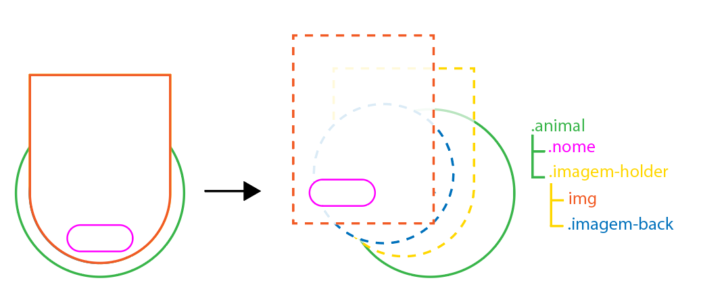
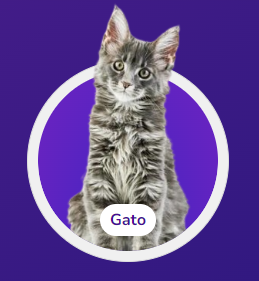

# Que animal posso adotar?

#### TLDR: Este é um projeto criado por mim para participar da Imersão Alura e Google Gemini em Setembro de 2024.
Você pode acessar a página neste link.

<br/>

## Desenvolvimento do projeto

O intuito do projeto foi testar meus conhecimentos, participar da premiação e talvez conseguir ficar em alguns lugar na votação ou receber uma menção, já estaria ótimo.

Minha ideia inicial era uma página onde o usuário pudesse conversar diretamente com um modelo de AI (Gemini) e este modelo ir montando uma página web de acordo com o que o usuário pedir. Como saiu um pouco do escopo do que foi explicado nas aulas eu então desenvolvi o Gemilura mas não quis utilizar na votação.

Mesmo amando o resultado do meu projeto anterior, inclusive deixarei disponível no meu perfil do Github, eu decidi criar uma segunda página, esta, onde são utilizadas as funções e usos do HTML, CSS e Javascript mais próximos do que foi passado nas aulas.

<br/>

### 1. Tecnologias utilizadas:

1. HTML
2. CSS
3. Javascript

<br/>

### 2. A ideia

Com tantos projetos incríveis aparecendo nos canais do discord da Imersão, fiquei em dúvida o que realmente tinha que fazer para que fosse algo diferente e criativo.

Meu primeiro passo foi pedir ao Gemini que listasse conteúdos interessantes para este projeto que chamasse a atenção das pessoas e que fosse algo fofo.

Dos itens que ele listou "Animais", "Relacionamento" e "Dinheiro" estavam no topo, então como sou péssimo com relacionamentos e quem dirá dinheiro, escolhi o mais fácil e mais cativante para mim.

O "quê" eu já tinha escolhido agora faltava o "como". Mais uma vez o Gemini me ajudou com temas relacionados com Animais e entre eles surgiram "Adoção" e "Curiosidades" então decidi unir os dois num catálogo de animais que, segundo nós dois (Gemini e eu) pudessem ser adotados.

Pedi pra que ele criasse um array com 100 animais seguindo a seguinte estrutura:

```javascript
{
    nome: "Nome do animal",
    imagem: "nome_do_animal.png",
    descricao: "Descrição do animal",
    adotavel: {
        valor: "Um pequeno texto falando se pode ou não ser adotado com um emoji",
        motivo: "Motivo para qual este animal é adotável ou não"
    }
}

```

E então eu consegui meu array de animais, infelizmente não os 100 mas talvez não tenha 100 animais no planeta 👀.

Agora eu tinha que decidir como mostrar estes animais. Pensei na mesma disposição mostrada nas aulas mas achei que a lista ficaria enorme se cada animal ocupasse toda a largura da página então pensei em diminuir um pouco para caber mais em uma altura menor.

Pedi pro Gemini me ajudar a criar um layout que deixasse as divs bem organizadas e dispostas na página e ele me deu duas opções:

1. Utilizar FLex,
2. Utilizar Grid.

Gostei do Flex pois fez exatamente o que eu queria mas não consegui fazer facilmente com que as últimas divs ficassem na esquerda ao invés do centr então preferi utilizar Grid. O layout ficou exatamente como eu queria.

Para os cards de animais decidi usar uma imagem com fundo transparente e ai eu tentaria fazer com que eles saíssem da div quando passar o mouse em cima. Pedi algumas ideias pro Gemini mas acabei fazendo do meu jeito.

Montei a div ".animal" da seguinte maneira e com os seguintes elementos:



Na div ".image-holder" eu coloquei um `border-radius: 0 0 100px 100px` para garantir que somente as border inferiores ficassem arredondatas e junto com `overflow: hidden` deu a impressão que a imagem do animal estava saindo do card. Ficou incrível.



Agora faltou a parte interativa que era mostrar as informações dos animais ao clicar nos cards.

Mais uma vez pedi dicas pro Gemini e ele me explicou que poderia utilizar Modal, que agora é suportado pelos browsers. Pedi um exemplo e ele me deu um que caiu como uma luva.

Depois estilizei o modal da maneira que combinasse com o visual do projeto e junto com o Gemini desenvolvi a lógica de clicar na div ".animal", encontrar o animal clicado no array de animais e carregar os dados nele no modal.

E assim o projeto tomou vida. Pela minha descrição pareceu uma eternidade mas durou somente 3:30h do início até postar no Github. Incrível!


Eu já conhecia HTML, CSS e Javacript mas é sempre bom ter novos desafios e conhecer coisas novas sempre que nos deparamos com algum projeto desafiador ou interessante.

Você pode acessar a página em Que animal posso adotar?